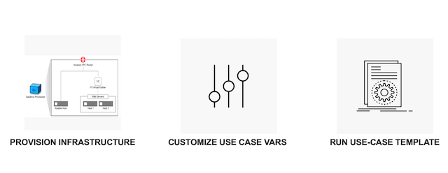

Ansible Lab & Use cases
========================

Once the infrastucture is up and running, you will have an environment that looks like below. You can now run various use cases or labs using this environment.

Ansible use cases
------------------
Click here for the `F5-Ansible use case templates <https://clouddocs.f5.com/training/fas-ansible-use-cases/>`_ that can be used on the sandbox environment you just provisioned. 

.. note::

   Your evironment is running in AWS and is incuring cost as your are running it. Once you are done using the environment make sure to teardown the lab infrastucture using the steps in the next section
