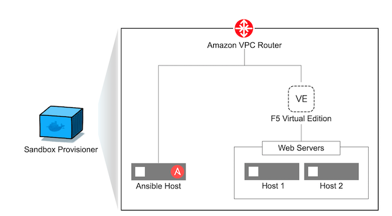

Ansible Provisioner
======================
The Ansible/F5 provisioner is an opensource provisioning tool. It is a collection of Ansible playbooks packaged to build and tear down F5 and application infrastructure. It can also be used to scale the infrastructure as needed by the user. 

The provisioner is made available as a Docker container to avoid environmental dependencies. In order to run the provisioner you will need the `Docker <https://docs.docker.com/install>`_ Community Edition.

This version of the provisioner can be used to deploy the following components into AWS. To run the provisioner you will need - An account on `AWS <https://aws.amazon.com/>`__

- F5 BIG-IP 
- Ansible node
- 2x Web servers

Installing the Provisioner
--------------------------
**Clone the Repository**

Clone the workshop repository on the docker_host. In our example we use /git/ as our directory.

   .. code::

      cd /git/
      git clone https://github.com/ansible/workshops.git

**Install Docker**

Using your local machine or a dedicated host, install `Docker <https://docs.docker.com/install/>`_.
Elsewhere in these instructions we will refer to the machine with the docker installation as **docker_host**.

**Create DockerFile and Build the Container**

The `docker build <https://docs.docker.com/engine/reference/commandline/build/>`_ command builds an image from a **Dockerfile**.
This image will be used to run the Ansible playbooks for the provisioner.
From the directory containing the **Dockerfile**, we will run the build command.

Create a Directory to store your docker file. In our example we use /git/docker/ and VI as our editor.

   .. code::

      cd /git/docker
      vi dockerfile

Insert the the code below in the dockerfile, save and exit.

   .. code::

      FROM python:alpine
      
      RUN set -ex \
         && apk --update add rpm openssh-client openssl ca-certificates wget \
         && apk --update add --virtual build-dependencies python3-dev libffi-dev openssl-dev build-base \
         && pip3 install --upgrade pip pycrypto cffi \
         && pip3 install ansible==2.9.9 \
         && pip3 install jinja2 \
         && pip3 install netaddr \
         && pip3 install pbr \
         && pip3 install hvac \
         && pip3 install jmespath \
         && pip3 install ruamel.yaml \
         && pip3 install boto \
         && pip3 install boto3 \
         && pip3 install passlib \
         && pip3 install paramiko \
         && pip3 install urllib3 \
         && apk del build-dependencies \
         && rm -rf /var/cache/apk/* \
         && mkdir -p /etc/ansible \
         && echo 'localhost' > /etc/ansible/hosts

      ENV ANSIBLE_GATHERING smart
      ENV ANSIBLE_HOST_KEY_CHECKING false
      ENV ANSIBLE_RETRY_FILES_ENABLED false
      ENV ANSIBLE_ROLES_PATH /ansible/playbooks/roles
      ENV ANSIBLE_SSH_PIPELINING True
      ENV PYTHONPATH /ansible/lib
      ENV PATH /ansible/bin:$PATH
      ENV ANSIBLE_LIBRARY /ansible/library
      
      WORKDIR /ansible/playbooks
      
      ENTRYPOINT ["ansible-playbook"]

**Build the Docker Container**

First you must build the dockerfile into a docker container. Make sure you are in the directory where the docker file was created then run the command (this could take a few minutes to complete)
Take note that the "period" (.) at the end of the command line is necessary to execute properly.

 .. code::
   
    cd /git/docker/
    docker build --no-cache -t "ansible_workshop:dockerfile" .

Assuming that the build was completed it should look something like this at the bottom of the code

 .. code::
 
    Successfully built e1ce736ec3fd
    Successfully tagged ansible_workshop:dockerfile

**AWS Setup**

- Create an Amazon AWS account
- Create an Access Key ID and Secret Access Key. Save the ID and key for later.
- New to AWS and not sure what this step means? `Click here <https://aws.amazon.com/premiumsupport/knowledge-center/create-access-key/>`__
- Make sure you have subscribed to the right marketplace AMI (Amazon Machine Image).
  
  - F5 BIG-IP `Click here to subscribe <https://aws.amazon.com/marketplace/pp/B079C4WR32>`__

Setup the F5 Ansible environment
---------------------------------

Now you can start to provision your application environment in AWS.

1. As we are using Ansible for provisioning the environment, you will need to configure a variable file 'f5_vars.yml', that will be used by the Ansible playbook. The variables in this file reflect your AWS environment.

   Our preference is to create a f5_vars file outside of the github repository for future pulls/updates can be done without hiding the file also incase of forking the environment your variables are not captured and stored in the cloud. 
   in our example we use /git/ as the directory to store the 'f5_vars.yml' file and VI as our editor

   .. code:: 

      cd /git/
      vi f5_vars.yml

   Here is an example of our 'f5_vars.yml' file feel free to edit sections that are required

   .. code:: 
    
      # Region (Change to your desired EC2 Region)
      ec2_region: us-west-2

      # Prefix (This is how the machines will be named and provides ease on identification in the AWS Console)
      ec2_name_prefix: MyUsername-TESTWORKSHOP1

      # Student total is how many labs you wish to create (Default is 1 - if changed it will deploy each VM (F5, Ansible, 2x Web Servers) by the amount of whatever this student number is) 
      student_total: 1

      # Identifies F5 Workshop (DO NOT CHANGE)
      workshop_type: f5

      # Admin Passwords on All Machines including the F5 (It is recommended to still use a secure password with Upper/Lower/Special Characters/Numbers and is recommended that it shouldnt conform to any Password used in your working/home environment.
      admin_password: Ansible123!
      
      #These Variables We are uncertain of their use but are required to be called out during the provisioning of the Ansible Workshop
      doubleup: no
      dns_type: aws
      create_login_page: true
      autolicense: false
      towerinstall: false

2. Run the Ansible playbook 

   To run this code for provisioning update the directories (provisioner and variables), AWS ID and KEY saved during the AWS Setup above.
   .. code:: 

      cd /git/workshops/provisioner
      docker run \
      -e AWS_ACCESS_KEY_ID=ABCDEFGHIJKLMNOP \
      -e AWS_SECRET_ACCESS_KEY=ABCDEFGHIJKLMNOP/ABCDEFGHIJKLMNOP \
      -v $(pwd)/../provisioner:/ansible/playbooks \
      -v /git:/ansible/vars \
      ansible_workshop:dockerfile provision_lab.yml -e @/ansible/vars/f5_vars.yml

   This command will take several minutes to complete.

   - The command mounts the repository's ``provisioner`` directory inside the container (``-v``) and passes AWS credentials as environment    variables (``-e``) to the container (the ``-e`` on the last line passes env variables to **ansible itself** and is not part of the      docker command). 
   - Docker supports multiple methods to `pass environment variables to a container <https://docs.docker.com/engine/reference/commandline/run/#set-environment-variables--e---env---env-file>`_
   - If the environment variable already exists, the ``-e VARIABLE`` construction prevents sensitive information from appearing in bash history or the running proc.

   Alternatively, if using an `AWS CLI credential file <https://docs.aws.amazon.com/cli/latest/userguide/cli-configure-files.html>`_ a mapped volume could be used. For example:
   .. code::
      
      cd /git/workshops/provisioner
      docker run \
      -v ~/.aws/credentials:/root/.aws/credentials \
      -v $(pwd)/../provisioner:/ansible/playbooks \
      -v /git:/ansible/vars \
      ansible_workshop:dockerfile provision_lab.yml -e @/ansible/vars/f5_vars.yml

   .. note::

      **If the provisioning is not successful**, please teardown the lab by running the teardown playbook as described below.

   .. code::

      cd /git/workshops/provisioner
      docker run \
      -e AWS_ACCESS_KEY_ID=ABCDEFGHIJKLMNOP \
      -e AWS_SECRET_ACCESS_KEY=ABCDEFGHIJKLMNOP/ABCDEFGHIJKLMNOP \
      -v $(pwd)/../provisioner:/ansible/playbooks \
      -v /git:/ansible/vars \
      ansible_workshop:dockerfile teardown_lab.yml -e @/ansible/vars/f5_vars.yml

   Alternatively, if using an `AWS CLI credential file <https://docs.aws.amazon.com/cli/latest/userguide/cli-configure-files.html>`_ a mapped volume could be used. For example:
   .. code::
      
      cd /git/workshops/provisioner
      docker run \
      -v ~/.aws/credentials:/root/.aws/credentials \
      -v $(pwd)/../provisioner:/ansible/playbooks \
      -v /git:/ansible/vars \
      ansible_workshop:dockerfile teardown_lab.yml -e @/ansible/vars/f5_vars.yml
   

   .. note::

     Correct the issue and run the provision playbook again (Step 2).

3. Login to the AWS EC2 console and you should see instances being created like:

   .. code ::

      MyUsername-TESTWORKSHOP1-studentX-ansible
      MyUsername-TESTWORKSHOP1-studentX-f5
      MyUsername-TESTWORKSHOP1-studentX-node1
      MyUsername-TESTWORKSHOP1-studentX-node2

Accessing your Environment
---------------------------

Once the provisioner has run successfully and infrastructure has been spun up.

All the workbench information is stored in a local directory named after the workshop (e.g. MyUsername-TESTWORKSHOP1/instructor_inventory.txt). 

Example: Make sure to go to the provisioner directory

   .. code::

      cd /git/workshops/provisioner
      cat MyUsername-TESTWORKSHOP1/instructor_inventory.txt
      
      [all:vars]
      ansible_port=22

      [student1]
      student1-ansible ansible_host=34.219.251.xxx ansible_user=ec2-user  #Ansible host/control node
      student1-f5 ansible_host=52.39.228.xxx ansible_user=admin           #BIG-IP
      student1-node1 ansible_host=52.43.153.xxx ansible_user=ec2-user     #Backend Web application server1
      student1-node2 ansible_host=34.215.176.xxx ansible_user=ec2-user    #Backend Web application server2

.. note::

   If there are more students configured there will be more entries to represent each student
   
1. Login to Ansible control node (IP from inventory file above) using the studentID (e.g. student1) and the password mentioned in the f5_vars.yml earlier

   .. code::

      ssh student1@34.219.251.xxx
      student1@34.219.251.xxx's password:
   
2. Run the ansible command with the --version command. The latest version of ansible will be installed

   .. code::

      [student1@ansible networking-workshop]$ ansible --version
      ansible 2.9.11
         config file = /home/student1/.ansible.cfg
         configured module search path = ['/home/student1/.ansible/plugins/modules', '/usr/share/ansible/plugins/modules']
         ansible python module location = /usr/lib/python3.6/site-packages/ansible
         executable location = /usr/bin/ansible
         python version = 3.6.8 (default, Dec  5 2019, 15:45:45) [GCC 8.3.1 20191121 (Red Hat 8.3.1-5)]

   .. note::
    
      The version of ansible you have might differ from above (the latest ansible version gets installed)
	
3. Use the commands below to view the contents of your inventory

   .. code::

      [student1@ansible ~]$ ls f5-workshop/
      [student1@ansible ~]$ cat lab-inventory/hosts

   The output will look as follows with student1 being the respective student workbench:

   Output from (ls f5-workshop)
   
   .. code::

      [student1@ansible ~]$ ls f5-workshop/
      1.0-explore    1.3-add-pool            1.6-add-irules           2.1-delete-configuration  3.1-as3-change     4.1-tower-job-template  README.ja.md
      1.1-get-facts  1.4-add-pool-members    1.7-save-running-config  2.2-error-handling        3.2-as3-delete     4.2-tower-workflow      README.md
      1.2-add-node   1.5-add-virtual-server  2.0-disable-pool-member  3.0-as3-intro             4.0-explore-tower  4.3-tower-workflow2     turn_off_community_grid.yml

   Output from (cat lab-inventory/hosts)
   .. code::
      
      [all:vars]
      ansible_user=studentx
      ansible_ssh_pass=<password_from_file>
      ansible_port=22

      [lb]
      f5 ansible_host=52.39.228.xxx ansible_user=admin private_ip=172.16.26.xxx ansible_ssh_pass=<password_from_file>

      [control]
      ansible ansible_host=34.219.251.xxx ansible_user=ec2-user private_ip=172.16.207.xxx

      [webservers]
      node1 ansible_host=52.43.153.xxx ansible_user=ec2-user private_ip=172.16.170.xxx
      node2 ansible_host=34.215.176.xxx ansible_user=ec2-user private_ip=172.16.160.xxx
	  
   .. note::
    
      The IP's in your environment will defer.
	  
      The values from the inventory file will be used in subsequent playbooks
	
4. Using your text editor of choice create a new file called bigip-facts.yml in the home directory ~/

   The BIG-IP input values are taken from the inventory file mentioned earlier

   .. code:: yaml

      ---
      - name: GRAB F5 FACTS
        hosts: lb
        connection: local
        gather_facts: no

        tasks:
        - name: Set a fact named 'provider' with BIG-IP login information
          set_fact:
           provider:
            server: "{{private_ip}}"
            user: "{{ansible_user}}"
            password: "{{ansible_ssh_pass}}"
            server_port: 8443
            validate_certs: no

        - name: COLLECT BIG-IP FACTS
          bigip_device_info:
            provider: "{{provider}}"
            gather_subset:
             - system-info
          register: device_facts
         
        - name: DISPLAY COMPLETE BIG-IP SYSTEM INFORMATION
          debug:
            var: device_facts

        - name: DISPLAY ONLY THE MAC ADDRESS
          debug:
            var: device_facts['system_info']['base_mac_address']

        - name: DISPLAY ONLY THE VERSION
          debug:
            var: device_facts['system_info']['product_version']

5. Run the playbook - exit back into the command line of the control host and execute the following:

   .. code:: bash

      cd ~/
      [student1@ansible ~]$ ansible-playbook bigip-facts.yml

6. The output will look as follows. This playbook is grabbing information from the BIG-IP and displaying the relevant information.

   .. code::

      [student1@ansible ~]$ ansible-playbook bigip-facts.yml

      PLAY [GRAB F5 FACTS] 
      ****************************************************************
      TASK [Set a fact named 'provider' with BIG-IP login information] 
      ****************************************************************
      ok: [f5]

      TASK [COLLECT BIG-IP FACTS] 
      ****************************************************************
      changed: [f5]

      TASK [DISPLAY COMPLETE BIG-IP SYSTEM INFORMATION] 
      ****************************************************************

      ok: [f5] =>
      device_facts:
         ansible_facts:
            discovered_interpreter_python: /usr/libexec/platform-python
         changed: false
         failed: false
         queried: true
         system_info:
            base_mac_address: 06:07:82:7f:d9:09
            chassis_serial: 46fc25ec-50a7-269e-edc8ae8cd962
            hardware_information:
            - model: Intel(R) Xeon(R) CPU E5-2686 v4 @ 2.30GHz
            name: cpus
            type: base-board
            versions:
            - name: cache size
               version: 46080 KB
            - name: cores
               version: 2  (physical:2)
            - name: cpu MHz
               version: '2299.968'
            - name: cpu sockets
               version: '1'
            - name: cpu stepping
               version: '1'
            marketing_name: BIG-IP Virtual Edition
            package_edition: Point Release 4
            package_version: Build 0.0.5 - Tue Jun 16 14:26:18 PDT 2020
            platform: Z100
            product_build: 0.0.5
            product_build_date: Tue Jun 16 14:26:18 PDT 2020
            product_built: 200616142618
            product_changelist: 3337209
            product_code: BIG-IP
            product_jobid: 1206494
            product_version: 13.1.3.4
            time:
            day: 17
            hour: 18
            minute: 15
            month: 8
            second: 12
            year: 2020
            uptime: 3925

      TASK [DISPLAY ONLY THE MAC ADDRESS] 
      ****************************************************************
      ok: [f5] =>
      device_facts['system_info']['base_mac_address']: 06:07:82:7f:d9:09

      TASK [DISPLAY ONLY THE VERSION] 
      ****************************************************************
      ok: [f5] =>
      device_facts['system_info']['product_version']: 13.1.3.4

      PLAY RECAP 
      ****************************************************************
      f5                         : ok=5    changed=0    unreachable=0    failed=0
   
You have been successful in logging into the BIG-IP and grabbing/displaying facts. 
Your access to the BIG-IP is verified.

**Congratulations, your lab is up and running!**

In the next section(s) you can explore Ansible use cases and the 101 lab that can be run on the environment you just built.
